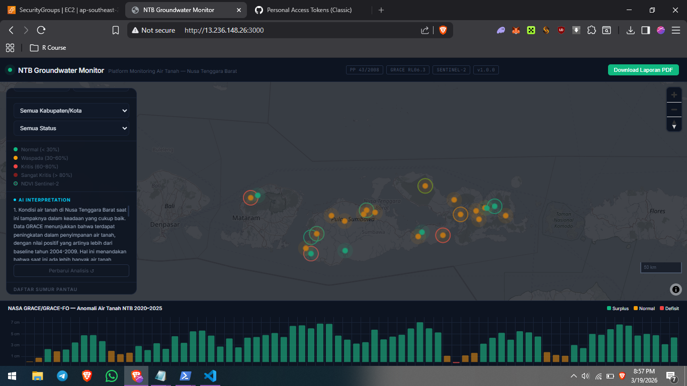
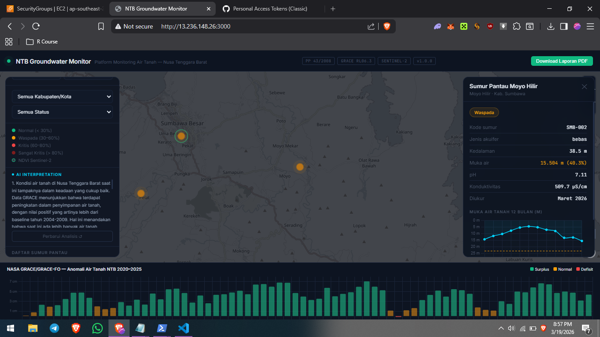
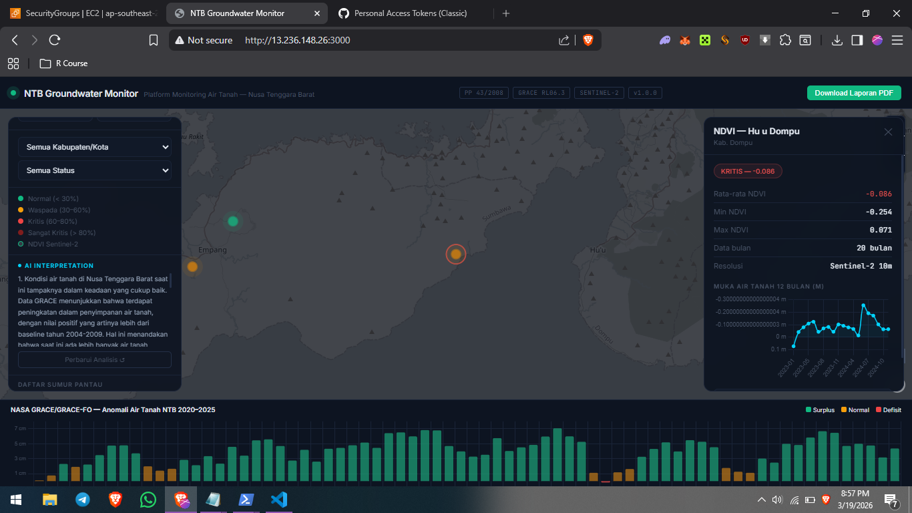

# NTB Groundwater Monitor

> Satellite-based groundwater monitoring platform for Nusa Tenggara Barat, Indonesia

**Live Demo:** http://13.236.148.26:3000 | **API Docs:** http://13.236.148.26:8000/docs

[](LICENSE)
[](https://peraturan.bpk.go.id)
[](https://grace.jpl.nasa.gov)
[](https://www.copernicus.eu)
[](http://13.236.148.26:3000)

---

## Overview

NTB (Nusa Tenggara Barat) has no integrated groundwater monitoring infrastructure, despite being one of Indonesia's most drought-vulnerable provinces. The 2023 El Niño caused measurable groundwater deficits felt directly by farmers in Sumbawa, Dompu, and Bima — yet no systematic data existed to document, anticipate, or respond to it.

This platform is a production proof-of-concept for satellite-based environmental monitoring infrastructure for NTB, combining NASA gravity satellite data, Sentinel-2 optical imagery, and AI-powered interpretation in a single dashboard.

**Built by:** Rizki Agustiawan, S.T. — Environmental Engineer, Universitas Teknologi Sumbawa, NTB, Indonesia  
**Status:** Production — Phase 6/6 complete  
**Enrolled:** NASA ARSET Training — Monitoring Groundwater Changes using GRACE/GRACE-FO (April 2026)

---

## Live Demo

**Dashboard:** http://13.236.148.26:3000  
**API:** http://13.236.148.26:8000/docs

Features visible in demo:
- 23 monitoring wells across Sumbawa, Dompu, Bima, Lombok Utara — color-coded by water table status
- NASA GRACE TWS anomaly bar chart (2020–2025) — December 2023 El Niño deficit clearly visible
- Sentinel-2 NDVI rings — vegetation condition per location
- AI interpretation panel in Bahasa Indonesia (Kimi moonshot-v1-8k)
- One-click PDF report download with legal references

---

## Scientific Basis

### NASA GRACE/GRACE-FO Terrestrial Water Storage
| Parameter | Value |
|---|---|
| Dataset | JPL GRACE Mascon RL06.3Mv04 CRI |
| Collection ID | TELLUS_GRAC-GRFO_MASCON_CRI_GRID_RL06.3_V4 |
| Temporal coverage | April 2002 – December 2025 (252 months) |
| Spatial resolution | 0.5° × 0.5° (~55 km at equator) |
| NTB grid points | 4 lat × 8 lon = 32 points |
| Records in database | 8,064 |
| Variable | lwe_thickness — Liquid Water Equivalent Thickness |
| Unit | cm equivalent water height (EWH) |
| Baseline | 2004–2009 mean |

**Key reference:**
Watkins, M. M., et al. (2015). Improved methods for observing Earth's time variable mass distribution with GRACE using spherical cap mascons. *J. Geophys. Res. Solid Earth*, 120, 2648–2671. doi:[10.1002/2014JB011547](https://doi.org/10.1002/2014JB011547)

### Sentinel-2 NDVI/NDWI
| Parameter | Value |
|---|---|
| Dataset | COPERNICUS/S2_SR_HARMONIZED via Google Earth Engine |
| Period | 2023–2024 |
| Records | 184 |
| Spatial resolution | 10 meter |
| Formula | NDVI = (B8-B4)/(B8+B4) |
| Cloud filter | < 30% cloud cover |

**Reference:** Rouse, J.W., et al. (1974). Monitoring vegetation systems in the Great Plains with ERTS. *NASA Special Publication*.

### TWS Anomaly Interpretation
| Value (cm EWH) | Status |
|---|---|
| > +2 | Surplus |
| 0 to +2 | Normal |
| -2 to 0 | Deficit |
| < -2 | Critical Deficit |

---

## Legal Framework

| Regulation | Relevance |
|---|---|
| PP No. 43 Tahun 2008 | Indonesian Groundwater Management Law |
| Perpres No. 33 Tahun 2018 | Cekungan Air Tanah (Groundwater Basin) list |
| PerMenLHK P.68/2016 | Water quality standards |
| SNI 6989.58:2008 | Groundwater sampling methodology |

---

## Tech Stack

| Layer | Technology |
|---|---|
| Frontend | MapLibre GL JS 4.1, Chart.js 4.4, vanilla JS |
| Backend | FastAPI 0.111, Python 3.11, asyncpg |
| Database | PostgreSQL 15 + PostGIS 3.3 |
| Satellite data | NASA GRACE NetCDF via xarray + podaac-data-downloader |
| Vegetation index | Sentinel-2 via Google Earth Engine Python API |
| AI interpretation | Kimi moonshot-v1-8k (OpenAI-compatible API) |
| PDF generation | ReportLab 4.2 |
| Infrastructure | Docker Compose, Nginx reverse proxy, AWS EC2 |

---

## Quick Start

### Prerequisites
- Docker Desktop or Docker Engine
- NASA Earthdata account — [register free](https://urs.earthdata.nasa.gov)
- Kimi API key — [platform.moonshot.ai](https://platform.moonshot.ai)

### Run locally
```bash
git clone https://github.com/rizkiagustiawan/ntb-groundwater-monitor.git
cd ntb-groundwater-monitor

# Set environment variables
cat > .env << EOF2
KIMI_API_KEY=your_kimi_api_key_here
DATABASE_URL=postgresql://rizki:ntb_env_2024@db:5432/ntb_groundwater
EOF2

docker compose up -d
```

Open: http://localhost:3000

### Load NASA GRACE data
```bash
# Install dependencies
python3 -m venv venv && source venv/bin/activate
pip install xarray netCDF4 numpy psycopg2-binary podaac-data-subscriber

# Setup NASA Earthdata credentials
echo "machine urs.earthdata.nasa.gov login YOUR_USER password YOUR_PASS" > ~/.netrc
chmod 600 ~/.netrc

# Download GRACE data
podaac-data-downloader \
  -c TELLUS_GRAC-GRFO_MASCON_CRI_GRID_RL06.3_V4 \
  -d ./data/grace \
  --start-date 2002-04-01T00:00:00Z \
  --end-date 2025-12-31T00:00:00Z \
  -e .nc

# Process into PostGIS
python scripts/grace_to_postgis.py
```

---

## API Reference

| Endpoint | Description |
|---|---|
| `GET /` | Platform info and legal basis |
| `GET /wells/geojson` | All monitoring wells as GeoJSON |
| `GET /wells/{id}/timeseries` | 12-month time series per well |
| `GET /grace/timeseries` | Monthly TWS anomaly for NTB |
| `GET /ndvi/summary` | NDVI summary per location as GeoJSON |
| `GET /ndvi/timeseries/{location}` | NDVI time series per location |
| `GET /ai/interpret` | AI-powered interpretation in Bahasa Indonesia |
| `GET /report/pdf` | Download PDF monitoring report |
| `GET /health` | Service health check |

Full interactive docs: http://13.236.148.26:8000/docs

---

## Data Coverage
```
Monitoring Wells (23 wells across 6 kabupaten/kota):
├── Kab. Sumbawa        8 wells  SMB-001 to SMB-008
├── Kab. Sumbawa Barat  3 wells  KSB-001 to KSB-003
├── Kab. Dompu          3 wells  DMP-001 to DMP-003
├── Kab. Bima           5 wells  BMA-001 to BMA-005
├── Kota Bima           2 wells  BIM-001 to BIM-002
└── Kab. Lombok Utara   2 wells  LUT-001 to LUT-002

GRACE Grid (NTB):
  Lat: -9.25, -8.75, -8.25, -7.75
  Lon: 115.75 to 119.25 (8 points)
  = 32 grid points × 252 months = 8,064 records
```

> **Note:** Well data is representative dummy data for development. Replace with verified data from Dinas ESDM NTB for operational use.

---

## Key Findings

From the NASA GRACE data currently loaded:

- **December 2023: -0.19 cm EWH** — Only deficit month in 2022–2025 period, coinciding with the 2023 El Niño event
- **2022: consistently high surplus** (+4–7 cm) — La Niña conditions
- **Dompu NDVI: 0.196 average** — Consistently sparse vegetation, highest drought vulnerability
- **Sekongkang NDVI: -0.038** — Negative values confirming dominance of exposed mining land (Batu Hijau area)

---

## Limitations

1. GRACE spatial resolution (0.5°, ~55 km) cannot resolve sub-regional variations within a single kabupaten
2. GRACE data gap: July 2017 – May 2018 (transition between GRACE and GRACE-FO missions)
3. Scale factor NaN for NTB coastal grid points — raw lwe_thickness used without CRI correction
4. Well data is synthetic — not operational monitoring data
5. AI interpretation quality depends on Kimi API availability

---

## Citation
```bibtex
@software{agustiawan2026ntb,
  author = {Agustiawan, Rizki},
  title = {NTB Groundwater Monitor: Satellite-based groundwater 
           monitoring platform for Nusa Tenggara Barat, Indonesia},
  year = {2026},
  url = {https://github.com/rizkiagustiawan/ntb-groundwater-monitor}
}
```

GRACE data:
```
Watkins et al. (2015). doi:10.1002/2014JB011547
Wiese et al. (2016). doi:10.1002/2016GL070571
```

---

## Roadmap

- [ ] Custom domain + HTTPS (SSL via Let's Encrypt)
- [ ] BMKG rainfall data integration
- [ ] Drought early warning system
- [ ] Mobile responsive UI
- [ ] Real well data from Dinas ESDM NTB
- [ ] Sentinel-1 SAR for land subsidence detection
- [ ] TROPOMI air quality layer

---

## Contributing

Pull requests welcome. Priority contributions needed:
- Real well monitoring data from ESDM NTB
- BMKG rainfall API connector
- Improved NDVI coordinate validation (Lombok Utara coastal fix)

---

## License

MIT License — see [LICENSE](LICENSE) for details.

---

*Built from Sumbawa, for Sumbawa.*  
*Nusa Tenggara Barat, Indonesia*

## Screenshots

### Dashboard Overview


### Well Detail Panel


### NDVI Sentinel-2 Analysis

