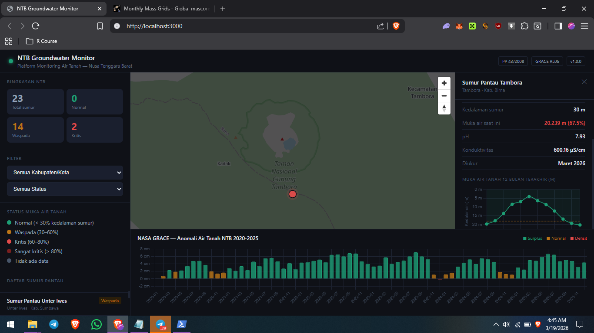

# NTB Groundwater Monitor

**Platform monitoring air tanah Nusa Tenggara Barat berbasis data satelit NASA GRACE dan pengukuran lapangan.**



[](LICENSE)
[](https://peraturan.bpk.go.id)
[](https://grace.jpl.nasa.gov)
[]()

---

## Overview

NTB Groundwater Monitor is an open-source WebGIS platform for monitoring groundwater conditions across Nusa Tenggara Barat (NTB), Indonesia. It integrates NASA GRACE/GRACE-FO satellite gravity data with field monitoring well measurements to provide an evidence-based picture of groundwater storage changes at provincial scale.

This platform was developed as a response to a critical gap: **NTB has no integrated groundwater monitoring infrastructure**, despite being one of Indonesia's most drought-vulnerable provinces. The December 2023 El Niño event caused groundwater deficits that farmers in Sumbawa, Dompu, and Bima experienced directly in the field — yet no systematic data existed to document, anticipate, or respond to it.

**Built by:** Rizki Agustiawan, S.T. — Environmental Engineer, Universitas Teknologi Sumbawa  
**Status:** Active development — Phase 2 of 6  
**License:** MIT

---

## Scientific Basis

### NASA GRACE/GRACE-FO Data
- **Dataset:** JPL GRACE and GRACE-FO Mascon RL06.3Mv04 CRI
- **Collection ID:** `TELLUS_GRAC-GRFO_MASCON_CRI_GRID_RL06.3_V4`
- **Temporal coverage:** April 2002 – December 2025 (252 months)
- **Spatial resolution:** 0.5° × 0.5° (~55 km at equator)
- **Variable:** `lwe_thickness` — Liquid Water Equivalent Thickness (cm)
- **Unit:** cm equivalent water height (EWH)
- **Baseline:** 2004–2009 mean (anomaly reference period)
- **NTB grid:** 4 lat × 8 lon = 32 grid points covering entire NTB province
- **Total records in database:** 8,064

**Key reference:**  
Watkins, M. M., D. N. Wiese, D.-N. Yuan, C. Boening, and F. W. Landerer (2015), Improved methods for observing Earth's time variable mass distribution with GRACE using spherical cap mascons, *J. Geophys. Res. Solid Earth*, 120, 2648–2671, doi:[10.1002/2014JB011547](https://doi.org/10.1002/2014JB011547)

**CRI filter reference:**  
Wiese, D. N., F. W. Landerer, and M. M. Watkins (2016), Quantifying and reducing leakage errors in the JPL RL05M GRACE mascon solution, *Geophys. Res. Lett.*, 43, 12,269–12,279, doi:[10.1002/2016GL070571](https://doi.org/10.1002/2016GL070571)

### Interpretation of TWS Anomaly Values
| Value (cm EWH) | Status | Interpretation |
|---|---|---|
| > +2 | **Surplus** | Above-average groundwater storage |
| 0 to +2 | **Normal** | Near average conditions |
| -2 to 0 | **Deficit** | Below-average storage |
| < -2 | **Critical Deficit** | Significant groundwater depletion |

> **Note:** Values represent anomaly relative to 2004–2009 baseline mean. A negative value does not necessarily indicate absolute water scarcity — it indicates storage is below the historical average for that month.

---

## Legal Framework

This platform was designed in compliance with Indonesian environmental and water law:

| Regulation | Relevance |
|---|---|
| **PP No. 43 Tahun 2008** | Pengelolaan Air Tanah — legal basis for groundwater monitoring |
| **Perpres No. 33 Tahun 2018** | Daftar Cekungan Air Tanah (CAT) Indonesia |
| **PerMenLHK P.68/2016** | Baku mutu air — water quality parameters |
| **SNI 6989.58:2008** | Metode pengambilan contoh air tanah |

Well status classification (Normal / Waspada / Kritis / Sangat Kritis) is derived from the ratio of current water table depth to total well depth, consistent with PP 43/2008 monitoring standards.

---

## Features

- **Interactive map** — 23 monitoring wells across Sumbawa, Dompu, Bima, Lombok Utara with color-coded status
- **GRACE satellite layer** — monthly TWS anomaly bar chart (2020–2025) from NASA data
- **Well detail panel** — click any well to see 12-month time series chart, pH, conductivity, aquifer type
- **Regional filter** — filter by kabupaten/kota and status level
- **Summary statistics** — real-time count of Normal / Waspada / Kritis wells province-wide
- **REST API** — all data accessible via documented JSON endpoints
- **Legal metadata** — every API response includes regulatory reference

---

## Tech Stack

| Layer | Technology |
|---|---|
| Frontend | MapLibre GL JS 4.1, Chart.js 4.4, vanilla JS |
| Backend | FastAPI 0.111, Python 3.11, asyncpg |
| Database | PostgreSQL 15 + PostGIS 3.3 |
| Satellite data | NASA GRACE RL06.3 NetCDF via xarray |
| Infrastructure | Docker Compose, Nginx reverse proxy |
| Data processing | xarray, numpy, scipy, psycopg2 |

---

## Quick Start

### Prerequisites
- Docker Desktop (Windows/Mac) or Docker Engine (Linux)
- NASA Earthdata account — register free at [urs.earthdata.nasa.gov](https://urs.earthdata.nasa.gov)

### 1. Clone repository
```bash
git clone https://github.com/rizkiagustiawan/ntb-groundwater-monitor.git
cd ntb-groundwater-monitor
```

### 2. Start all services
```bash
docker compose up -d
```

First run downloads PostgreSQL + nginx images (~500MB). Wait ~2 minutes.

### 3. Open dashboard
```
http://13.236.148.26:3000
```

API documentation:
```
http://localhost:8000/docs
```

### 4. Load NASA GRACE data (optional — required for satellite layer)

```bash
# Install Python dependencies
python -m venv venv && source venv/bin/activate
pip install xarray netCDF4 numpy psycopg2-binary podaac-data-subscriber

# Setup NASA Earthdata credentials
echo "machine urs.earthdata.nasa.gov login YOUR_USERNAME password YOUR_PASSWORD" > ~/.netrc
chmod 600 ~/.netrc

# Download GRACE data
podaac-data-downloader \
  -c TELLUS_GRAC-GRFO_MASCON_CRI_GRID_RL06.3_V4 \
  -d ./data/grace \
  --start-date 2002-04-01T00:00:00Z \
  --end-date 2025-12-31T00:00:00Z \
  -e .nc

# Process and load into PostGIS
python scripts/grace_to_postgis.py
```

---

## API Reference

| Endpoint | Description |
|---|---|
| `GET /` | Platform info and legal basis |
| `GET /wells/geojson` | All monitoring wells as GeoJSON |
| `GET /wells/{id}/timeseries` | 12-month time series for one well |
| `GET /grace/tws` | GRACE TWS grid data with spatial filter |
| `GET /grace/timeseries` | Monthly TWS anomaly time series for NTB |
| `GET /summary/kabupaten` | Risk summary per kabupaten |
| `GET /health` | Service health check |

Full interactive docs: `http://localhost:8000/docs`

---

## Data Coverage

```
NTB Province Monitoring Wells (23 wells):
├── Kab. Sumbawa      (8 wells) — SMB-001 to SMB-008
├── Kab. Sumbawa Barat (3 wells) — KSB-001 to KSB-003
├── Kab. Dompu        (3 wells) — DMP-001 to DMP-003
├── Kab. Bima         (5 wells) — BMA-001 to BMA-005
├── Kota Bima         (2 wells) — BIM-001 to BIM-002
└── Kab. Lombok Utara (2 wells) — LUT-001 to LUT-002

GRACE Satellite Grid (NTB):
  Lat: -9.25, -8.75, -8.25, -7.75
  Lon: 115.75, 116.25, 116.75, 117.25, 117.75, 118.25, 118.75, 119.25
  = 32 grid points × 252 months = 8,064 records
```

> **Important:** Well coordinates and measurements in this repository are representative dummy data for development purposes. For operational deployment, replace with verified data from Dinas ESDM NTB or BPBD NTB.

---

## Roadmap

- [x] **Phase 1** — Docker stack, PostGIS schema, FastAPI, MapLibre dashboard
- [x] **Phase 2** — NASA GRACE data pipeline, TWS anomaly visualization
- [ ] **Phase 3** — Sentinel-2 NDVI/NDWI layer via Google Earth Engine
- [ ] **Phase 4** — API integration for AI-powered anomaly interpretation
- [ ] **Phase 5** — Full dashboard UI with export (CSV, PDF report)
- [ ] **Phase 6** — Methodology note, VPS deployment, presentation to Dinas ESDM NTB

---

## Limitations

1. **Spatial resolution:** GRACE data at 0.5° (~55 km) cannot resolve sub-regional variations within a single kabupaten. It represents the integrated signal over large areas.
2. **Temporal gap:** GRACE ended in 2017; GRACE-FO launched in 2018. An 11-month gap exists in the record (Jul 2017 – May 2018).
3. **Well data:** Current well data is synthetic (dummy coordinates and measurements). Real operational use requires integration with actual ESDM NTB monitoring data.
4. **Scale factor:** The CRI scale factor for NTB grid points was NaN (ocean-land boundary effect). Raw `lwe_thickness` values are used without scale factor correction. This is noted as a limitation for scientific publication.

---

## Citation

If you use this platform or its methodology in research or reports, please cite:

```
Agustiawan, R. (2025). NTB Groundwater Monitor: An open-source WebGIS platform 
for groundwater monitoring in Nusa Tenggara Barat using NASA GRACE/GRACE-FO 
satellite data. GitHub. https://github.com/YOUR_USERNAME/ntb-groundwater-monitor
```

And the underlying GRACE data:
```
Watkins, M. M., et al. (2015). doi:10.1002/2014JB011547
Wiese, D. N., et al. (2016). doi:10.1002/2016GL070571
```

---

## Contributing

Pull requests welcome. For major changes, open an issue first.

Priority contributions needed:
- Real well data from ESDM NTB
- Sentinel-2 GEE integration
- BMKG rainfall data connector
- Bahasa Indonesia UI translation

---

## License

MIT License — see [LICENSE](LICENSE) for details.

---

*Built from Sumbawa, for Sumbawa.*  
*Nusa Tenggara Barat, Indonesia.*
