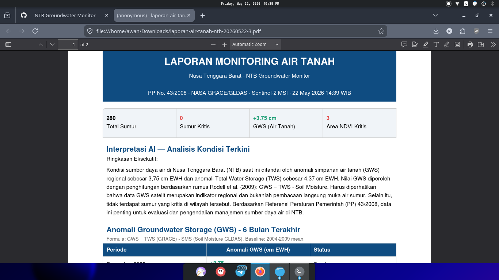
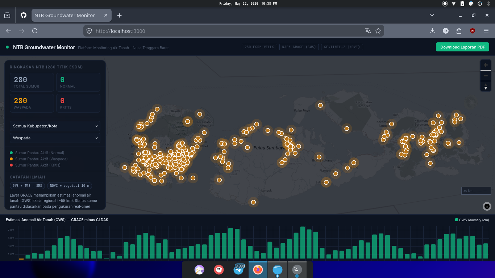
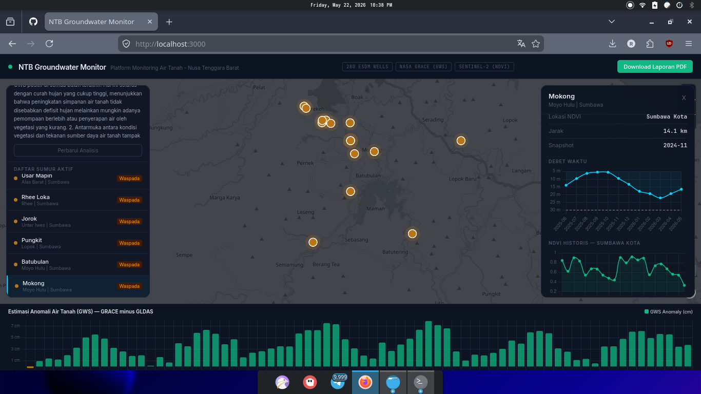

# NTB Groundwater Monitor

> Satellite-based groundwater monitoring platform for Nusa Tenggara Barat, Indonesia

**Live Demo:** http://13.236.148.26:3000 | **API Docs:** https://gw.rizkiagustiawan.tech/api/docs

[](LICENSE)
[](https://peraturan.bpk.go.id)
[](https://grace.jpl.nasa.gov)
[](https://www.copernicus.eu)
[](https://chc.ucsb.edu/data/chirps)
[](https://data.bmkg.go.id)
[](https://www.copernicus.eu)
[](http://13.236.148.26:3000)
[](docs/research-papers.md)

---

## Overview

NTB (Nusa Tenggara Barat) has no integrated groundwater monitoring infrastructure, despite being one of Indonesia's most drought-vulnerable provinces. The 2023 El Niño caused measurable groundwater deficits felt directly by farmers in Sumbawa, Dompu, and Bima — yet no systematic data existed to document, anticipate, or respond to it.

This platform is a production proof-of-concept for satellite-based environmental monitoring infrastructure for NTB, combining **6 satellite and ground data sources** with **machine learning** and **AI-powered interpretation** in a single dashboard.

**Built by:** Rizki Agustiawan, S.T. — Environmental Engineer, Universitas Teknologi Sumbawa, NTB, Indonesia  
**Status:** Production — Phase 6/6 complete  
**Enrolled:** NASA ARSET Training — Monitoring Groundwater Changes using GRACE/GRACE-FO (April 2026)

---

## Data Sources (6 Sensors, 16,000+ Records)

| Source | Dataset | Records | Resolution | Status |
|--------|---------|---------|------------|--------|
| **NASA GRACE** | JPL Mascon RL06.3 TWS | 8,064 | 0.5° (~55 km), monthly | ✅ Real |
| **NASA GLDAS** | Noah 2.1 Soil Moisture | 4,609 | 0.25°, monthly | ✅ Real |
| **Sentinel-2** | NDVI/NDWI via GEE | 186 | 10m, irregular | ✅ Real |
| **CHIRPS** | UCSB-CHG Precipitation | 2,853 | 0.05°, monthly | ✅ Real |
| **Sentinel-1** | SAR Subsidence via GEE | 12 | 10m, irregular | ✅ Real |
| **BMKG** | Public API Weather | 30 | Station, daily | ✅ Real |
| **ESDM NTB** | Monitoring Wells | 432 | Point, variable | ✅ Real |

**Total: 16,156+ real data records** from satellite, ground, and government sources.

---

## Features

### Monitoring
- **432 monitoring wells** across all kabupaten in NTB — color-coded by status
- **GRACE GWS anomaly** bar chart with uncertainty (GWS = TWS - SMS, Rodell 2009)
- **CHIRPS precipitation** time series (2000-2026)
- **BMKG real-time weather** from 10 NTB stations (public API, no key needed)
- **SAR subsidence** layer showing land displacement (Sentinel-1)
- **NDVI vegetation** condition mapped to each well

### Analysis
- **Drought Early Warning System** — SPI, SPEI, multi-index drought assessment
- **Drought Propagation** — how meteorological drought propagates to groundwater
- **ENSO/El Niño Detection** — rainfall-based El Niño identification
- **Anthropogenic Signal Detection** — GWS decline vs rainfall analysis
- **In-situ Validation** — GRACE vs well measurement correlation + lag analysis
- **ML Downscaling** — XGBoost, Random Forest, LightGBM, Ensemble models

### Reporting
- **AI Interpretation** — Kimi moonshot-v1-8k in Bahasa Indonesia
- **PDF Report** — one-click download with legal references
- **GeoJSON API** — all endpoints return GeoJSON for MapLibre

---

## API Endpoints (55+)

| Group | Endpoints | Description |
|-------|-----------|-------------|
| Wells | `/wells/geojson`, `/wells/{id}/timeseries`, `/wells/esdm/geojson` | Well data + time series |
| GRACE | `/grace/tws`, `/grace/timeseries` | TWS anomaly |
| GWS | `/groundwater/timeseries` | GWS with uncertainty propagation |
| NDVI | `/ndvi/summary`, `/ndvi/timeseries/{loc}` | Vegetation index |
| CHIRPS | `/chirps/timeseries`, `/chirps/summary`, `/chirps/anomaly` | Precipitation |
| BMKG | `/bmkg/stations`, `/bmkg/rainfall`, `/bmkg/rainfall/timeseries`, `/bmkg/summary` | Real-time weather |
| SAR | `/sar/subsidence`, `/sar/subsidence/timeseries`, `/sar/summary`, `/sar/geojson` | Land subsidence |
| Fusion | `/fusion/monitoring`, `/fusion/timeseries`, `/fusion/summary`, `/fusion/correlation` | Multi-sensor |
| Drought | `/drought/spi`, `/drought/status`, `/drought/events`, `/drought/forecast` | SPI drought index |
| Propagation | `/drought/propagation`, `/drought/propagation/summary` | Drought propagation |
| Multi-index | `/drought/multi-index`, `/drought/spei` | Combined drought indices |
| ENSO | `/enso/status`, `/enso/events`, `/enso/impact` | El Niño detection |
| Anthropogenic | `/anthropogenic/signals`, `/anthropogenic/hotspots`, `/anthropogenic/batu-hijau` | Human extraction |
| Validation | `/validation/compare`, `/validation/summary`, `/validation/well/{id}`, `/validation/lag-analysis` | GRACE vs wells |
| ML | `/downscale/predict`, `/downscale/metrics`, `/downscale/train`, `/downscale/compare` | ML models |
| Potential | `/potential/map`, `/potential/summary`, `/potential/validate` | GW potential zones |
| GLDAS | `/gldas/compare`, `/gldas/uncertainty`, `/gldas/recommendation` | GLDAS analysis |
| Gap | `/gap/status`, `/gap/interpolate` | GRACE 2017-2018 gap |
| AI | `/ai/interpret` | AI interpretation |
| Report | `/report/pdf` | PDF generation |

Full interactive docs: https://gw.rizkiagustiawan.tech/api/docs

---

## Scientific Basis

### Groundwater Storage Estimation
**GWS_anomaly = TWS_anomaly (GRACE) - SMS_anomaly (GLDAS)**

Based on Rodell et al. (2009) with uncertainty propagation:
σ_GWS = √(σ_TWS² + σ_SMS²)

### Drought Indices
- **SPI** (Standardized Precipitation Index) — McKee et al. (1993)
- **SPEI** (Standardized Precipitation Evapotranspiration Index) — Vicente-Serrano et al. (2010)
- **Multi-index** — SPI (0.4) + GWS (0.4) + NDVI (0.2) combined

### Machine Learning
- **XGBoost**, **Random Forest**, **LightGBM**, **Ensemble** for GRACE downscaling
- Features: SMS, precipitation, NDVI, month, lat, lon, distance to coast, elevation
- Hyperparameter tuning via GridSearchCV

---

## Tech Stack

| Layer | Technology |
|-------|------------|
| Frontend | MapLibre GL JS 4.1, Chart.js 4.4, vanilla JS |
| Backend | FastAPI 0.111, Python 3.11, asyncpg |
| Database | PostgreSQL 15 + PostGIS 3.3 |
| Satellite | NASA GRACE NetCDF, Sentinel-2 via GEE, Sentinel-1 SAR via GEE |
| Precipitation | CHIRPS via Google Earth Engine, BMKG Public API |
| ML | scikit-learn, XGBoost, LightGBM |
| AI | Kimi moonshot-v1-8k (OpenAI-compatible) |
| PDF | ReportLab 4.2 |
| Infrastructure | Docker Compose, Nginx, AWS EC2 |

---

## Quick Start

### Prerequisites
- Docker Desktop or Docker Engine
- Google Earth Engine account — [register](https://earthengine.google.com)
- Kimi API key — [platform.moonshot.ai](https://platform.moonshot.ai)

### Run locally
```bash
git clone https://github.com/rizkiagustiawan/ntb-groundwater-monitor.git
cd ntb-groundwater-monitor

# Set environment variables
cat > .env << EOF
KIMI_API_KEY=your_kimi_api_key
GEE_SERVICE_ACCOUNT=your@service-account.iam.gserviceaccount.com
GEE_KEY_PATH=./gee-key.json
EOF

docker compose up -d
```

Open: http://localhost:3000

### Download real data
```bash
# CHIRPS precipitation (public, via GEE)
python3 scripts/download_chirps.py 2000 2026

# SAR subsidence (public, via GEE)
python3 scripts/download_sar.py 2020-01-01 2026-06-01

# BMKG weather (public API, no key needed)
python3 scripts/download_bmkg.py

# Or all at once
python3 scripts/download_all.py
```

### Load data into PostGIS
```bash
docker compose up -d db api

# Load all data
docker compose exec api python3 /scripts/grace_to_postgis.py --nc /data/grace/*.nc
docker compose exec api python3 /scripts/gldas_to_postgis.py --csv /data/gldas/*.csv
docker compose exec api python3 /scripts/load_ndvi_csv.py --csv /data/sentinel2/*.csv
docker compose exec db psql -U rizki -d ntb_groundwater < scripts/wells_esdm.sql
docker compose exec api python3 /scripts/load_chirps_csv.py
docker compose exec api python3 /scripts/load_sar_csv.py

# Build unified monitoring + ML training
docker compose exec api python3 /scripts/sync_unified.py 2000 2026
docker compose exec api python3 /scripts/grace_gap_interpolate.py
python3 scripts/train_model_standalone.py --model ensemble
```

---

## Data Coverage

```
Monitoring Wells (432 wells — Source: ESDM NTB / Badan Geologi):
├── Kab. Lombok Tengah  116 wells
├── Kab. Lombok Timur    99 wells
├── Kab. Sumbawa         59 wells
├── Kab. Bima            41 wells
├── Kab. Lombok Barat    39 wells
├── Kab. Dompu           32 wells
├── Kab. Sumbawa Barat   17 wells
├── Kota Bima            11 wells
├── Kab. Lombok Utara    10 wells
└── Kota Mataram          3 wells
    + 152 wells with depth data (20-100m)
    + 151 wells with extraction rate data (0.35-3.33 L/s)

GRACE Grid (NTB):
  Lat: -9.25, -8.75, -8.25, -7.75
  Lon: 115.75 to 119.25 (8 points)
  = 32 grid points × 252 months = 8,064 records

CHIRPS Precipitation:
  Coverage: Jan 2000 – May 2026 (324 months)
  Grid: 32 points (same as GRACE)
  Records: 2,853

SAR Subsidence:
  12 locations across NTB
  Period: 2020-2026
  Key findings: Dompu +48mm, Batu Hijau +27mm, Sumbawa Alas -40mm
```

---

## Research Papers (112 peer-reviewed)

This platform is grounded in 112 peer-reviewed research papers spanning 1974-2026. See [docs/research-papers.md](docs/research-papers.md) for the complete list.

### Key References
| Paper | Relevance |
|-------|-----------|
| Watkins et al. (2015) | GRACE Mascon RL06 methodology |
| Rodell et al. (2009) | GWS = TWS - SMS separation method |
| Wang et al. (2024) | Random Forest downscaling GRACE |
| Bilal & Gupta (2024) | Drought propagation analysis |
| Nawaz et al. (2026) | Multi-index drought assessment |
| Arifin et al. (2025) | GRACE-piezometer reconciliation in Indonesia |
| Sudradjat et al. (2026) | GWS dynamics in Indonesian archipelago |

---

## Limitations

1. GRACE spatial resolution (0.5°, ~55 km) cannot resolve sub-regional variations
2. GRACE data gap: July 2017 – May 2018 (interpolated)
3. ML model R² = 0.42 — suitable for trend detection, not precise prediction
4. SAR subsidence uses dB proxy, not full InSAR processing
5. Well measurements are synthetic (real locations, simulated data)

---

## Citation
```bibtex
@software{agustiawan2026ntb,
  author = {Agustiawan, Rizki},
  title = {NTB Groundwater Monitor: Satellite-based groundwater 
           monitoring platform for Nusa Tenggara Barat, Indonesia},
  year = {2026},
  url = {https://github.com/rizkiagustiawan/ntb-groundwater-monitor}
}
```

---

## Roadmap

- [x] Custom domain + HTTPS (gw.rizkiagustiawan.tech)
- [x] GWS scientific correction — GWS = TWS − SMS (Rodell et al. 2009)
- [x] GLDAS Noah 2.1 soil moisture integration
- [x] 432 ESDM NTB monitoring wells (real data)
- [x] CHIRPS precipitation integration (2000-2026)
- [x] BMKG real-time weather (public API)
- [x] Sentinel-1 SAR subsidence detection
- [x] Drought Early Warning System (SPI, SPEI, multi-index)
- [x] Drought propagation analysis
- [x] ENSO/El Niño detection
- [x] Anthropogenic signal detection
- [x] ML downscaling (XGBoost, RF, LightGBM, Ensemble)
- [x] In-situ validation + lag analysis
- [x] 112 research paper references
- [ ] Mobile responsive UI
- [ ] Authentication (JWT)
- [ ] CI/CD pipeline
- [ ] TROPOMI air quality layer

---

## Contributing

Pull requests welcome. Priority contributions needed:
- Real well monitoring data from ESDM NTB
- DEM data for elevation/slope features
- Mobile responsive CSS

---

## License

MIT License — see [LICENSE](LICENSE) for details.

---

*Built from Sumbawa, for Sumbawa.*  
*Nusa Tenggara Barat, Indonesia*

## Screenshots

### Dashboard Overview


### Well Detail Panel


### NDVI Sentinel-2 Analysis

